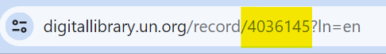
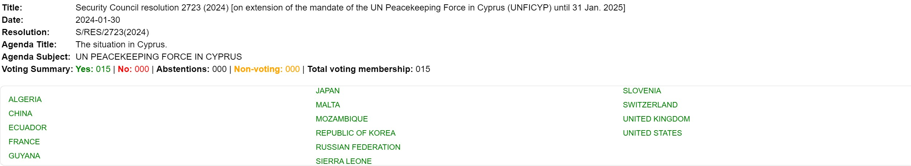

UN Resolutions Voting Data

This code is designed to parse and extract information from JSON data related to resolutions in the context of the United Nations. It provides convenient methods to access key attributes such as date, title, resolution text, agenda details, and voting summaries.

# Usage
```
# Import the Resolution class
from resolution import Resolution

# Create an instance of the Resolution class by passing the JSON data
resolution_data = {...}  # Replace with actual JSON data
resolution = Resolution(json_data=resolution_data)

# Access resolution attributes
print(resolution.title)
print(resolution.date)
print(resolution.resolution)
print(resolution.agenda_title)
print(resolution.agenda_subject)
print(resolution.voting_summary)

# Extract votes information
print(resolution.votes)

# Access countries with specific votes
print(resolution.get_countries_with_yes_vote())
print(resolution.get_countries_with_abstentions_vote())
print(resolution.get_non_voting_countries())
print(resolution.get_countries_with_no_vote())
```

# Flask App
A simple web app, using the un_resolution_voting package is hosted on the the following [link](https://un-resolutions-s5e6gpyfea-uc.a.run.app/)
simply use the 7 digit record id from the url



An image can be downloaded
